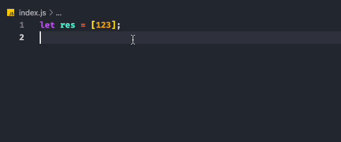

    

<h1>convenience-log</h1>

## 🦹‍♂️ 开发目的

主要解决本人平时训练算法或者设计模式等其他练习的时候需要编写大量打印所导致的繁琐操作，特此开发这个插件。

## 🌟 用途

- 主要解决平常打印时候的繁琐操作，不用动手赋值要打印的值，不用刻意选取值，只需使用快捷键可打印想要的参数

## 🕹 使用

##  开发中学到：
 - vscode.DocumentFilter: 文档选择器类型 用于缩小文件范围

 - vscode.window.activeTextEditor: 获取当前活动的编辑器页面
 api地址： https://code.visualstudio.com/api/references/vscode-api#TextEditor

 - vscode.window.activeTextEditor.document:  代表一个文本文件，如一个源文件。文本文件有行和关于底层资源的知识，如文件。
 api地址： https://code.visualstudio.com/api/references/vscode-api#TextDocument

 - vscode.window.activeTextEditor.Selection: 代表一个编辑器中的文本选择。
api地址： https://code.visualstudio.com/api/references/vscode-api#Selection

- vscode.window.activeTextEditor.document.getWordRangeAtPosition: 获取给定位置的单词内容，第一个参数可使用自定义正则表达式去除空
api地址： https://code.visualstudio.com/api/references/vscode-api#TextDocument  (在下面的getWordRangeAtPosition)

-  vscode.window.activeTextEditor.document.getWordRangeAtPosition.getText: 获取该范围的文本
api地址： https://code.visualstudio.com/api/references/vscode-api#TextDocument  (在下面的geText)

- vscode.window.activeTextEditor.edit: 编辑当前页 （函数）
api地址： https://code.visualstudio.com/api/references/vscode-api#TextEditor (在下面的edit)
回调：(editBuilder: TextEditorEdit) => void 提供增删改查的方法 
api地址： https://code.visualstudio.com/api/references/vscode-api#TextEditorEdit (寻找Methods)

- vscode.window.activeTextEditor.document.lineAt: 获取行
api地址：https://code.visualstudio.com/api/references/vscode-api#TextDocument (寻找lineAt)